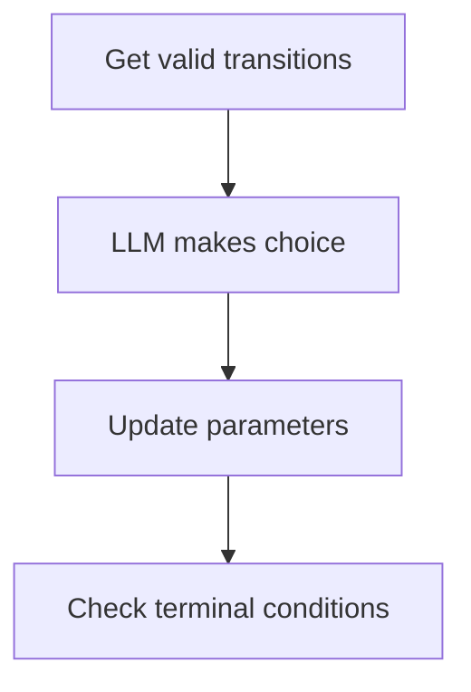

# LLM Quest Benchmark
[](https://www.python.org/downloads/)
[](https://opensource.org/licenses/MIT)

Advanced framework for evaluating LLM decision-making in complex narrative environments using Space Rangers QM quests.

## Core Concepts

### 1. QM Structure
```python
class QMStructure:
    parameters: Dict[str, QMParameter]  # 48 parameter types
    locations: Dict[str, QMLocation]    # Nodes with multiple descriptions
    transitions: List[QMTransition]      # Conditional branches
    start_location: str                 # Initial node
```

### 2. State Management
- Tracks 48 quest parameters with success/failure conditions
- Maintains decision history and time progression
- Validates transitions using parameter ranges

### 3. LLM Agent Interface
```python
class QuestAgent:
    def choose_action(state: QuestState,
                     valid_transitions: List[QMTransition]) -> int
```

### 4. Evaluation Metrics
- Success rate across multiple runs
- Parameter optimization efficiency
- Decision consistency scores
- Critical error analysis

## Benchmark Workflow

1. **Initialization**
```python
qm = QMParser.parse("quests/smugglers.qm")
agent = VLLMAdapter("meta-llama/Llama-3-70b")
```

2. **State Tracking**
```python
state = QuestState(
    current_location=qm.start_location,
    parameters=initial_parameters,
    history=[]
)
```

3. **Decision Cycle**


4. **Evaluation**
```python
metrics = BenchmarkRunner().run_episode(agent, qm)
print(f"Success Rate: {metrics.success_rate}")
```

## Key Features
- Full support for 48 QM parameters
- Adapter support for fine-tuned models
- Contamination-resistant quest variants
- Multi-dimensional evaluation metrics

## Overview

This benchmark uses text quests (.qm files) from the classic game "Space Rangers" as a testing ground for LLM agents.
Each quest represents a complex decision tree with:
- Multiple valid paths to success/failure with clear win/loss conditions
- Parameter-based state tracking
- Long-term consequences of decisions

The system evaluates LLMs on their ability to:
- Understand context and make consistent decisions
- Optimize for long-term outcomes


## Setup

```bash
git clone https://github.com/yourconscience/llm-quest-benchmark
cd llm-quest-benchmark
pip install -r requirements.txt
```

## Usage (WIP)

```python
benchmark = QuestBenchmark(
    qm_path="quests/example.qm",
    agents=["openrouter/anthropic/claude-3-opus",
            "openrouter/meta-llama/llama-3-70b"]
)

results = []
for agent in benchmark.agents:
    episode_result = benchmark.run_episode(agent)
    results.append({
        "model": agent.model,
        **episode_result
    })
```

## License
MIT License - See LICENSE for details.

Disclaimer: This project is not affiliated with Elemental Games or the Space Rangers franchise. Quest content is modified for research purposes only.

## LLM Integration

The benchmark uses LiteLLM as the unified interface for multiple LLM providers:

```python
# Supported providers
agent = LiteLLMAdapter("openai/gpt-4")
agent = LiteLLMAdapter("anthropic/claude-3-opus")
agent = LiteLLMAdapter("openrouter/meta-llama/llama-3-70b")
```

### Configuration

1. Create `.env` file with your API keys:
```bash
OPENAI_API_KEY=your_key
ANTHROPIC_API_KEY=your_key
OPENROUTER_API_KEY=your_key
```

2. Supported providers:
- OpenAI (GPT models)
- Anthropic (Claude models)
- OpenRouter (various models)

Note: Local LLM support is not included in the initial version but can be added through LiteLLM customization.