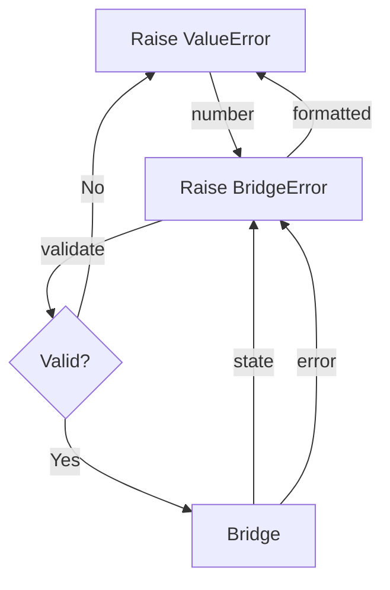

# Simplified QM Workflow - Proposal

## Core Problem
Current implementation tries to maintain game state in both TypeScript and Python,
leading to synchronization issues and complexity. We need to simplify this by having
a single source of truth and minimal state transformation.

## Proposed Changes

### 1. Bridge as State Manager
- Make TypeScript bridge the ONLY state manager
- Consistent JSON format between parse/interactive modes
- Always include location ID and full state in responses
- Example response format:
  ```json
  {
    "locationId": "123",
    "text": "Current text",
    "choices": [
      {
        "id": "456",
        "text": "Choice text"
      }
    ],
    "gameEnded": false,
    "params": {},  // Optional game parameters
    "reward": 0    // Optional reward value
  }
  ```

### 2. Simplified Environment
- Remove QMGame, QMLocation, QMChoice classes
- Environment only maintains:
  1. Bridge process
  2. Current observation text
  3. Current choices mapping
- No state duplication or tracking

### 3. Direct Choice Handling (Enhanced)
- ChoiceMapper becomes simple {number: choice.id} map
- Add explicit validation step:
  ```python
  def validate_choice(choice_num: int) -> str:
      if choice_num not in self.choice_map:
          raise ValueError(
              f"Invalid choice {choice_num}. Valid: {list(self.choice_map.keys())}\n"
              f"Current State: {json.dumps(self.bridge_state, indent=2)}"
          )
      return self.choice_map[choice_num]
  ```

### 4. Clear Data Flow (Expanded)
Add explicit error propagation:


### 5. Testing Improvements (Concrete Examples)
Add debug helper format:
```python
def format_debug_state(state: dict) -> str:
    return (
        f"Location: {state['locationId']}\n"
        f"Choices:\n" +
        "\n".join(f"{i+1}. {c['text']} ({c['id']})"
                for i, c in enumerate(state['choices']))
    )
```

## Benefits
1. Single source of truth (Bridge)
2. No state synchronization needed
3. Simpler error handling
4. Easier testing
5. Clear responsibility boundaries

## Migration Path (Updated)
1. Update bridge to provide consistent format
2. Simplify environment:
   - Remove `QMGame` dependency
   - Add state snapshotting via:
   ```python
   class QMEnv:
       def __init__(self):
           self.state_history: List[dict] = []

       def _record_state(self, state: dict):
           self.state_history.append(deepcopy(state))
   ```
3. Update tests for new structure
4. Add debugging helpers
