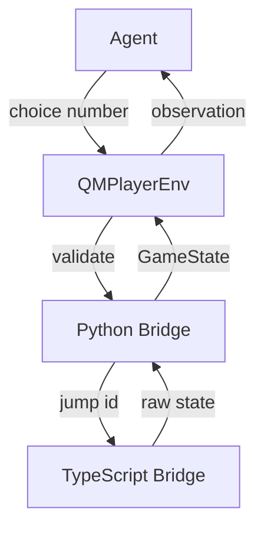

# QM Workflow

## Architecture Overview

The QM workflow is built around a TypeScript bridge that serves as the single source of truth for game state and logic. This design provides a clean separation of concerns:

### 1. TypeScript Bridge (Single Source of Truth)
- Handles all QM file parsing and game state management
- Provides consistent JSON format for all operations
- Example state format:
  ```json
  {
    "state": {
      "text": "Current text",
      "choices": [
        {
          "id": "456",
          "text": "Choice text"
        }
      ],
      "gameState": "active"
    },
    "saving": {
      "locationId": "123",
      "paramValues": {}
    }
  }
  ```

### 2. Python Bridge Layer (`bridge.py`)
- Manages TypeScript process lifecycle
- Handles communication protocol
- Provides clean Python interface:
  ```python
  class GameState:
      location_id: str
      text: str
      choices: List[Dict]
      game_ended: bool
      params: Dict
      reward: float
  ```

### 3. Environment Layer (`qm.py`)
- Implements TextArena interface
- Manages choice mapping (numbers to jump IDs)
- Formats observations and state
- Tracks history and renders output

## Data Flow


## Choice Handling
1. Agent provides choice number (1-based)
2. Environment validates and maps to jump ID
3. Bridge sends jump ID to TypeScript
4. TypeScript executes jump and returns new state
5. Bridge formats state into Python objects
6. Environment updates TextArena state and renders

## Error Handling
1. Choice validation in environment
2. Process management in bridge
3. State validation in bridge
4. Clear error messages propagated up

## Testing Strategy
1. Unit tests for each layer
2. Integration tests for full pipeline
3. End-to-end tests with real quests
4. Debug logging at each level

## Development Guidelines
1. Keep TypeScript bridge as source of truth
2. Handle all text formatting in Python
3. Use clear error messages
4. Maintain comprehensive logging
5. Keep state immutable where possible
