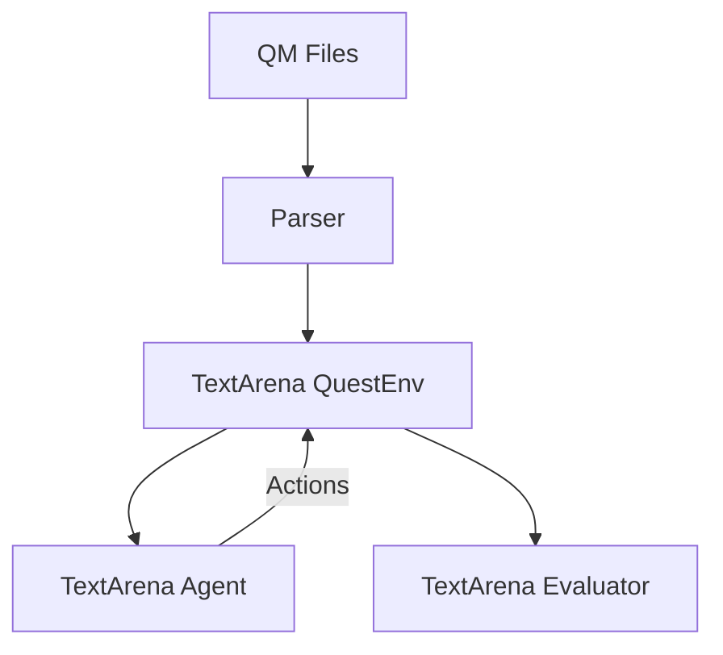

# LLM Quest Benchmark Roadmap

## Core Architecture Principles
1. **Minimal TextArena Integration** - Use TextArena for agent management and evaluation infrastructure
2. **QM First** - Focus on faithful Space Rangers quest translation rather than generic game support
3. **Developer Happiness** - Choose interesting tech over "production-ready" solutions

## Key Components

## Implementation Steps

### Phase 1: Basic Playable Environment
1. **QM TextArena Adapter** (`src/qm_adapter.py`)
   - ✓ Parse QM files using space-rangers-quest TypeScript parser
   - ✓ Convert to simple Python data structures
   - ✓ Map locations and choices to TextArena observations
   - ✓ Track quest state and handle actions

2. **Quest-Specific Agent** (`src/llm_agent.py`)
   - ✓ Basic QuestAgent using TextArena's agent system
   - ✓ Strategic wrapper for analysis before action
   - ✓ Basic step-by-step reasoning
   - ✓ Jinja templates for prompts
   - [ ] Add memory of past choices

3. **State Visualization** (`src/renderers/quest_renderer.py`)
   - [ ] Rich-based custom renderer
   - [ ] ASCII art for locations (optional)
   - [ ] Quest state display
   - [ ] Action history tracking

### Phase 2: Evaluation System
1. **Quest Metrics** (`src/metrics.py`)
   - [ ] Success rate tracking
   - [ ] Narrative coherence scoring
   - [ ] Decision consistency metrics
   - [ ] Resource efficiency tracking

2. **Benchmark Suite** (`configs/benchmarks`)
   - [ ] Test quest collection
   - [ ] Model comparison configs
   - [ ] Metrics aggregation
   - [ ] Results visualization

### Phase 3: Advanced Features
1. **Agent Improvements**
   - [ ] Quest-specific knowledge injection
   - [ ] Different agent personalities
   - [ ] Multi-turn reasoning
   - [ ] Memory management

2. **Multi-Agent Mode**
   - [ ] Competitive quest solving
   - [ ] Agent collaboration
   - [ ] Performance comparison

3. **Infrastructure**
   - [ ] VLLM local serving
   - [ ] Results database
   - [ ] Web dashboard

## Technology Choices

### Keep
- TextArena (core infrastructure)
- Rich (terminal rendering)
- QM format (authentic Space Rangers feel)

### Add
- vLLM (local model serving)
- LiteLLM (unified API layer)
- Guidance (for structured output from LLMs)

### Remove
- Custom state management (use TextArena's)
- Low-level game engine code

## First Week Milestones
1. [✓] Basic QM file loading in TextArena environment
2. [✓] Basic agent structure with TextArena integration
3. [ ] Strategic agent completing test quest
4. [ ] Basic metrics collection

## Learning Opportunities
- TextArena's wrapper system
- vLLM model serving
- LiteLLM routing
- Guidance templating
- Rich terminal UI

This keeps the architecture focused while letting you explore modern LLM ops tools!

## Current Sprint
1. [✓] Basic environment and agent integration
2. [✓] Strategic agent with reasoning
3. [✓] Migrate to Jinja templates for prompts
4. [ ] End-to-end quest completion with LLM
   - [ ] Test quest selection and preparation
   - [ ] Agent response validation
   - [ ] Basic logging and debugging
5. [ ] Basic metrics collection

## Workflow
1. Development:
   - Write tests first
   - Use type hints
   - Document with docstrings

2. Testing:
   - Unit tests for core components
   - Integration tests for full pipeline
   - Benchmark runs for models

3. Deployment:
   - Local development setup
   - Containerized evaluation
   - Results tracking